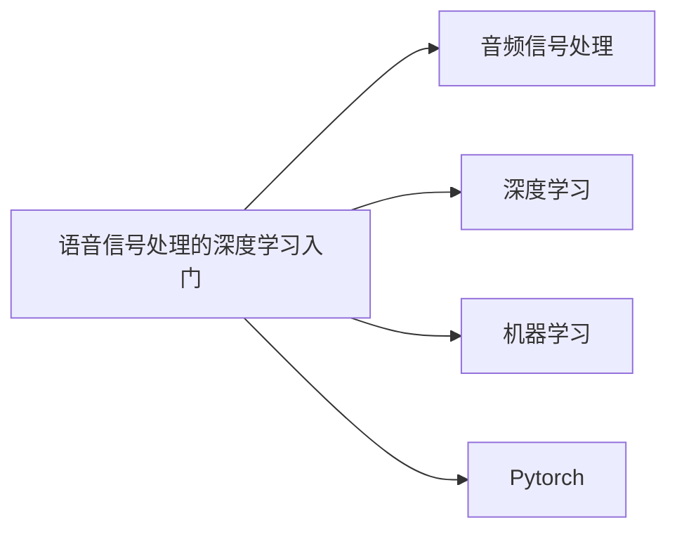

# 语音信号处理

## 涉及知识领域
1. 信号与系统
2. 复变函数
3. 数字信号处理
4. 语音信号处理
5. 高频电子线路
6. 数字电路
7. 线性代数
8. 概率论
9. Python数据分析
10. 高等数学
11. 深度学习
12. 机器学习

## 相关链接
1. 入门
   1. [语音信号处理的深度学习入门(一) (zhihu)](https://zhuanlan.zhihu.com/p/386467252)
   2. [【机器学习】语音处理介绍 (csdn)](https://blog.csdn.net/sword_csdn/article/details/109238620)
   3. [Youngmoo Kim: Applied DSP (YoutUbe)](https://www.youtube.com/watch?v=yGeXEwdNd_s&list=PL_QS1A2ZqaG7p50cd0AgLeG9Q3TN64vZJ&index=1)
2. 傅里叶变换
   1. [如果看了这篇文章你还不懂傅里叶变换，那就过来掐死我吧 (zhihu)](https://zhuanlan.zhihu.com/p/19759362)
   2. [傅里叶分析之掐死教程（完整版） (zhihu)](https://zhuanlan.zhihu.com/p/19763358)
   3. [“掐死”傅里叶 (weixin)](https://mp.weixin.qq.com/s?__biz=MzI5MDUyMDIxNA==&mid=2247515457&idx=1&sn=0c1950fe3c01d78e78246092c1c55c1b&chksm=ec1c50b8db6bd9ae155236657186a26064a2eea878c2264f790a4ebdc9cea65c6ffb521a1dd9&scene=21#wechat_redirect)
3. Valerio Velardo的语音信号处理
   1 . Audio Signal Processing for ML
      1. [面向机器学习的语音信号处理(一) (zhihu)](https://zhuanlan.zhihu.com/p/355622380)
      2. [面向机器学习的语音信号处理(二) (zhihu)](https://zhuanlan.zhihu.com/p/356364039)
      3. [面向机器学习的语音信号处理(三) (zhihu)](https://zhuanlan.zhihu.com/p/357117781)
      4. [Audio Signal Processing for ML (Youtube)](https://www.youtube.com/watch?v=iCwMQJnKk2c&list=PL-wATfeyAMNqIee7cH3q1bh4QJFAaeNv0)
      5. [Audio Signal Processing for ML (bilibili转载)](https://www.bilibili.com/video/av632609802/?vd_source=db6dec5bf996aeebec915f38fd1192d4)
      6. [Audio Signal Processing for ML (Github: code & PPT)](https://github.com/musikalkemist/AudioSignalProcessingForML)
   1. PyTorch for Audio
      1. [PyTorch for Audio (Youtube)](https://www.youtube.com/watch?v=gp2wZqDoJ1Y&list=PL-wATfeyAMNoirN4idjev6aRu8ISZYVWm)
      2. [PyTorch for Audio (bilibili转载)](https://www.bilibili.com/video/av638088068/?vd_source=db6dec5bf996aeebec915f38fd1192d4)
      3. [PyTorch for Audio (Github: code & PPT)](https://github.com/musikalkemist/pytorchforaudio)
4. 深度学习
   1. [吴恩达深度学习deeplearning.ai (bilibili转载)](https://www.bilibili.com/video/BV1FT4y1E74V/?spm_id_from=333.1007.top_right_bar_window_custom_collection.content.click)
   2. [Dive into DL--PyTorch (Github)](https://github.com/ShusenTang/Dive-into-DL-PyTorch)
   3. [Transformer代码复现](http://www.egbenz.com/#/my_article/49)
5. 机器学习
   1. CS229
      1. [CS229 机器学习 · 2018年 (bilibili转载)](https://www.bilibili.com/video/BV1JE411w7Ub/?spm_id_from=333.1007.top_right_bar_window_custom_collection.content.click)
      2. [cs229-2018-autumn (Github: note & solution)](https://github.com/maxim5/cs229-2018-autumn)
   2. 统计学习方法
      1. [《统计学习方法》电子版 (pdf)](../../%E6%9D%8E%E8%88%AA%20%E7%BB%9F%E8%AE%A1%E5%AD%A6%E4%B9%A0%E6%96%B9%E6%B3%95%20%E7%AC%AC%E4%BA%8C%E7%89%88.pdf)
      2. [《统计学习方法》电子版下载 (pan.baidu)](https://pan.baidu.com/share/init?surl=zDgK28ylbeyY7WGt6yCoRg)
      3. [《统计学习方法》带读 (bilibili)](https://www.bilibili.com/video/BV1W7411N7Ag/?spm_id_from=333.1007.top_right_bar_window_custom_collection.content.click&vd_source=db6dec5bf996aeebec915f38fd1192d4)
      4. [统计学习方法（第二版）习题解答 (Github)](https://github.com/datawhalechina/statistical-learning-method-solutions-manual)
      5. [统计学习方法（第二版）习题解答 (在线阅读地址)](https://datawhalechina.github.io/statistical-learning-method-solutions-manual/#/)