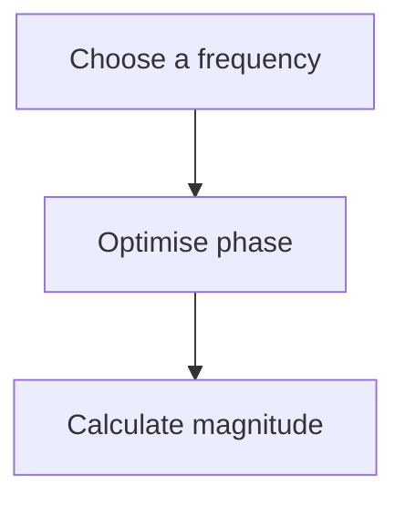
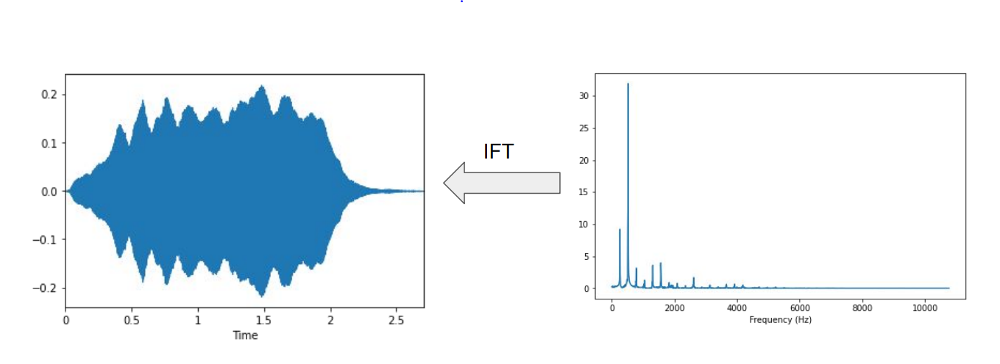

# Demystifying the Fourier Transform: The Intuition (解密“傅里叶变换”-直观理解)

## 一、Intuition (直观理解)
- Decompose a complex sound into its frequency components (把一个复杂的语音分解为”频率分量“，类似下图所示（从时域到频域）)

> 时域和频域:
> 1. 时域：信号在时间轴随时间变化的总体概括
>    - 画出的波形：波形图
>    - 横轴：时间
>    - 纵轴：音频的**波幅**（**amplitude**）
> 2. 频域：把时域波形的表达式做傅立叶等变化得到复频域的表达式
>    - 画出的波形：频谱图
>    - 横轴：频率
>    - 纵轴：该频率信号的**波幅幅值**（**magnitude**）

## 二、Deeper intuition (更深入的直观理解)
- Compare signal with sinusoids of various frequencies (和多个频率的正弦波”比较“)
- For each frequency we get a magnitude and a phase (每个频率，我们有一个“大小/重要度”和相位)
- High magnitude indicates high similarity between the signal and a sinusoid (**高的"magnitude"**(幅值)意味着原始时域信号和该正弦波之间有**更高的相似度**)

## 三、Fourier transform: Step by step
$$\huge\ sin(2\pi\cdot(ft-\varphi))$$

对所有频率的正弦信号进行上述操作，得出**哪一个频率的正弦信号**是原始信号的重要组成部分

## 四、Fourier transform
$$\varphi_f=argmax_{\varphi\in[0, 1)}\left(\int s(t)\cdot sin(2\pi\cdot(ft-\varphi))\cdot dt\right)$$
$$d_f = \mathop{max}\limits_{\varphi\in[0, 1)}\left(\int s(t)\cdot sin(2\pi\cdot(ft-\varphi))\cdot dt\right)$$

上面两个公式分别是 给定$f$计算相位 和 给定$f$计算幅值

## 五、Reconstructing a signal (重建一个信号 - 逆傅里叶变换)
- Superimpose sinusoids (叠加正弦波)
- Weight them by the relative magnitude (根据对应的”相似度量级“赋予不同正弦波不同的权重)
- Use relative phase (使用相对相位)
- Original signal and FT have same information (原始的信号和FT有相同的”信息量“)

