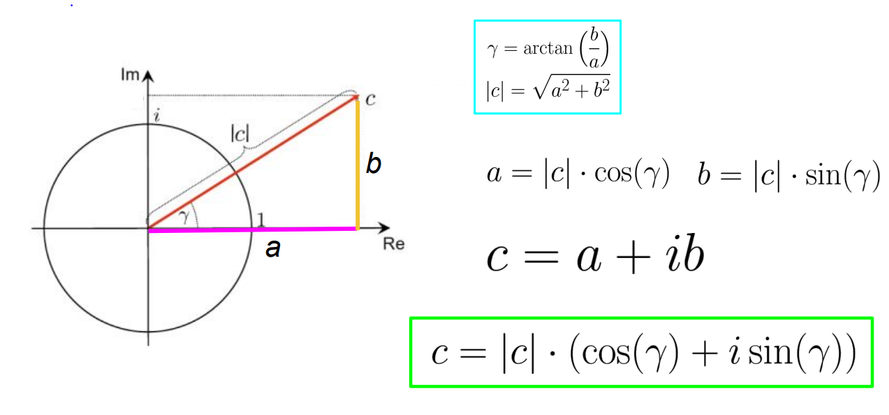

# Complex Numbers for Audio Signal Processing (语音信号处理中的复数)
## 一、Why bother with complex numbers? (为啥要用复数)
- Fourier transform -> magnitude and phase (傅里叶变换 -> 幅值和相位)
- Magnitude is a real number (幅度幅值是实数（原始信号和一个正弦波的相似度量级）)
- … something with magnitude + phase? (幅度幅值和相位？)

## 二、Euler formula (欧拉公式)
$$\huge e^{i\gamma}=\textnormal{cos}(\gamma)+i\textnormal{sin}(\gamma)$$
- Euler identity (欧拉恒等式): 
  $$e^{i\pi}+1=0$$
- Complex representation -> Polar coordinate representation(负数表示->极坐标表示): 
  $$\huge c=a+ib=|c|e^{i\gamma}$$
  
  - Scales distance from origin(距离原点的距离): 
    $$|c|=\sqrt{a^2+b^2}$$
  - Direction of a number in the complex plane(数在复平面上的方向): 
    $$\gamma=\textnormal{arctan}\left(\displaystyle\frac{b}{a}\right)$$