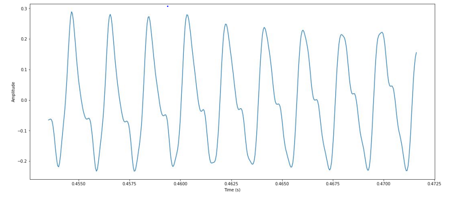
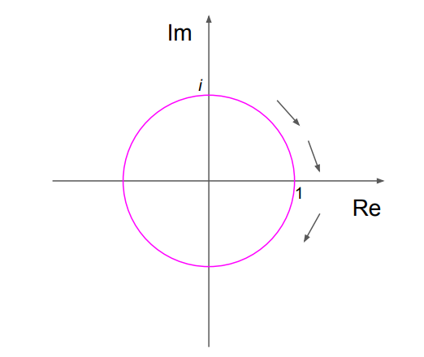
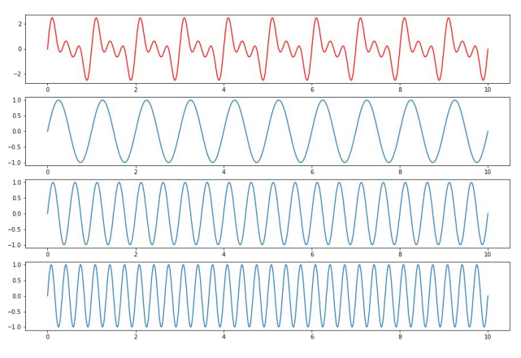

# Defining the Fourier Transform Using Complex Numbers (用复数定义傅里叶变换)
> Review: 非周期连续时间信号傅里叶变换（课本定义）
> - $FT$ (时域->频域)：$$X(j\omega)=\int_{-\infty}^{\infty}x(t)e^{-j\omega t}dt$$
> - $FT^{-1}$ (频域->时域)：$$x(t)=\frac{1}{2\pi}\int_{-\infty}^{\infty}X(j\omega)e^{j\omega t}d\omega$$

## 一、Previously (复习前两章的内容)
下面两个公式分别是 给定$f$计算相位 和 给定$f$计算幅值：
$$\varphi_f=argmax_{\varphi\in[0, 1)}\left(\int s(t)\cdot sin(2\pi\cdot(ft-\varphi))\cdot dt\right)$$
$$d_f = \mathop{max}\limits_{\varphi\in[0, 1)}\left(\int s(t)\cdot sin(2\pi\cdot(ft-\varphi))\cdot dt\right)$$

Polar coordinate representation(极坐标表示): 
  $$c=|c|\cdot e^{i\gamma}$$

## 二、The intuition (直观理解)
- Use magnitude and phase as polar coordinates (使用“幅值”和”相位”，作为极坐标的参数)
- Encode both coefficients in a single complex number (把两个系数编码到一个复数上)

## 三、Complex Fourier transform coefficients (复数傅里叶变换系数)
**复数傅里叶变换系数**$c_f$是基于$d_f$和$\varphi_f$的极坐标表示得到的复数：
$$c_f=\frac{d_f}{\sqrt{2}}\cdot e^{-i2\pi \varphi_f}$$
- $d_f$除以$\sqrt{2}$的原因: **常量正则项**
- $\varphi_f$乘以$-2\pi$的原因：
  - $\varphi_f$乘以$2\pi$是把 **频率$\varphi_f$ 变为 角频率$\omega_f$**
  - $\varphi_f$乘以$-1$是为了 让在极坐标系中 相位增加时，从原来的 **逆时针旋转 变为 顺时针旋转**

$$\huge \hat{g}(f)=c_f\ \ \ \ \ \ \ f\rightarrow \hat{g}(f):\mathbb{R}\rightarrow\mathbb{C}$$

## 四、Continuous audio signal (连续音频信号)
$$\huge g(t)\ \ \ \ \ \ \ t\rightarrow g(t):\mathbb{R}\rightarrow\mathbb{R}$$
> $g(t)$是多个正弦信号的叠加

## 五、Complex Fourier transform (复数傅里叶变换)
### 1. Fourier transform (傅里叶变换) 重点!
$$\huge \hat{g}(f)=\int g(t)\cdot e^{-i2\pi ft}dt$$
- 实际上，**指定频率的**$\hat{g}(f)$就是复平面上的一个点（对复平面上所有点求和，详情见代码）
- $FT$公式中$e^{-i2\pi ft}$的含义: 
  
  随着t的增加，顺时针跟踪复平面中的单位圆；此外，f越大，围着单位圆旋转的速度越快
  > 实际上就是正弦信号的复数形式

  

  

- $FT$公式中$\displaystyle\int g(t)\cdot e^{-i2\pi ft}dt$的含义:

  原始信号$g(t)$ 乘以 正弦波$e^{-i2\pi ft}$(复数形式) 并对$t$积分，得到一个频率为$f$的复数傅里叶变换系数$\hat{g}(f)$

- $FT$公式整体含义：
  
  分解原始的音频信号$g(t)$，变为许多不同频率的复数傅里叶变换系数$\hat{g}(f)$
- $\hat{g}(f)=\displaystyle\int g(t)\cdot e^{-i2\pi ft}dt=\underbrace{\int g(t)\cdot \textnormal{cos}(-2\pi ft)dt}_{\textnormal{Real \ part}} + i\underbrace{\int g(t)\cdot \textnormal{sin}(-2\pi ft)dt}_{\textnormal{Imaginary\ part}}$

### 2. Magnitude and phase (幅值和相位)
已知$\hat{g}(f)=c_f=|\hat{g}(f)|e^{i\gamma_f}=\frac{d_f}{\sqrt{2}}\cdot e^{-i2\pi \varphi_f}$, 得
- $d_f=\sqrt{2}\cdot|\hat{g}(f)|$
- $\varphi_f=\displaystyle\frac{\gamma_f}{2\pi}$

通过计算$\hat{g}(f)$距离复平面圆心的距离$|\hat{g}(f)|$和水平轴夹角$\gamma_f$, 得到$c_f$的magnitude $d_f$和phase $\gamma_f$

### 3. Inverse Fourier transform (逆傅里叶变换)
$$\huge g(t)=\frac{1}{2\pi}\int \hat{g}(f)\cdot e^{i2\pi ft}df$$
Add up all (weighted) sinusoids (把（加权的）所有频率的信号分量叠加在一起，得到原始信号): 

- 逆傅里叶变换公式的含义：

  已知$\hat{g}(f)=c_f=|\hat{g}(f)|e^{i\gamma_f}=\frac{d_f}{\sqrt{2}}\cdot e^{-i2\pi \varphi_f}$, 显然$\hat{g}(f)$分为 magnitude (幅频) 和 phase (相频) 两部分

  **所以频率为$f$的正弦波$e^{i2\pi ft}$先乘以$|\hat{g}(f)|$加权，再乘以$e^{i\gamma_f}$进行相位位移，从频域到时域完整还原原始信号中频率为$f$的分量**

  对$f$积分就是**把还原后的所有频率的分量加起来**，在除以正交基的周期积分为$2pi$，**最后得到最初的原始信号**

## 六、A Fourier roundtrip (FT & IFT)
$$\huge \textnormal{FT:}\ \ \ \ \ \ \ \ \ \ \hat{g}(f)=\int g(t)\cdot e^{-i2\pi ft}dt$$
$$\huge \textnormal{FT}^{-1}:\ \ g(t)=\frac{1}{2\pi}\int \hat{g}(f)\cdot e^{i2\pi ft}df$$