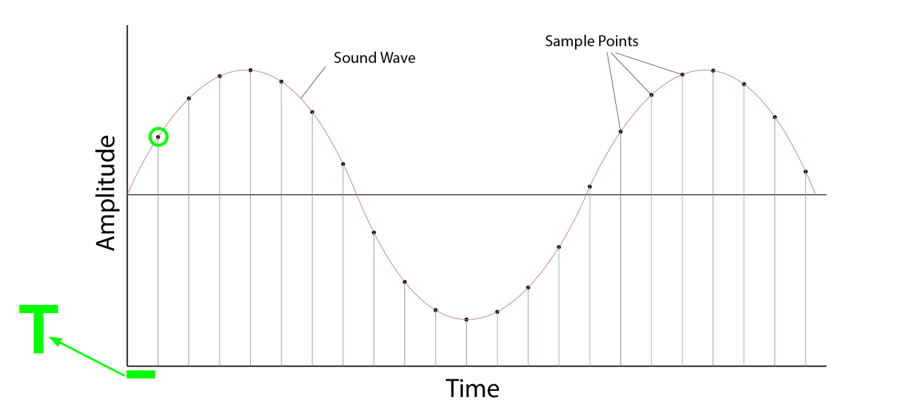
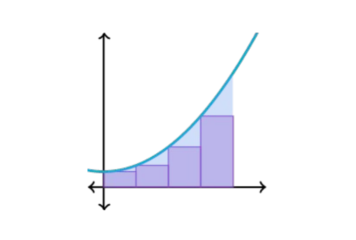

# Discrete Fourier Transform (离散傅里叶变换)
> Review: 离散傅里叶变换（课本定义）
> - 时域->频域 ($DFT$)：$$X(k)=\sum_{n=0}^{n=N-1}x[n]e^{\frac{-j\omega n}{N}k}\ \ \ \ \ \ \ \ 0\leq k\leq N-1$$
> - 频域->时域 ($DFT^{-1}$)：$$x[n]=\frac{1}{N}\sum_{k=0}^{k=N-1}X(k)e^{\frac{-j\omega n}{N}k}\ \ \ \ 0\leq n\leq N-1$$

## 一、Previously (复习前一章的内容)
$$\huge \textnormal{FT:}\ \ \ \ \ \ \ \hat{g}(f)=\int g(t)\cdot e^{-i2\pi ft}dt$$
其中$g(t)$是原始语音，$\hat{g}(f)=|\hat{g}(f)|e^{i\gamma_f}$是复数傅里叶变换系数;

而$\hat{g}(f)$分为 magnitude (幅频) 和 phase (相频) 两部分

## 二、Digitalization (离散化)

- 采样周期: $T = \displaystyle\frac{1}{s_r}$

## 三、Digital signal (数字信号)
$$\huge g(t)\mapsto x[n]$$
$$\huge n=\frac{t}{T}$$
- $n$: 采样点序号, 且$n\in[0, N-1]$
- $N$: 采样点个数 (或 频率取值数量)

## 四、Building a discrete Fourier transform (建立一个离散傅里叶变换)
$$\huge \textnormal{FT:}\ \ \ \ \ \ \ \ \hat{g}(f)=\int g(t)\cdot e^{-i2\pi ft}dt$$
$$\huge \textnormal{DFT}:\ \ \ \ \hat{x}(f)=\sum_{n=0}^{N-1}x[n]\cdot e^{-i2\pi fn}$$
$$\hat{x}(k)=\sum_{n=0}^{N-1}x[n]\cdot e^{-i2\pi s_r n \frac{k}{N}}\ \ \ ,k\in[0, N-1]$$
- DFT: Visual interpretation

  

  上图形象的给出了，“求和”和“积分”之间的关系:

  紫色部分的一个个长方形的面积之和，是蓝色曲线 (原始的模拟信号波形) 下方的区域的面积的近似。

### Hack 1: Time (技法1，时间)
- Consider f to be non 0 in a finite time interval (频率f在一个有限时间区间上是非0的)
- x(0), x(1), …, x(N-1) (**N个采样点**)

### Hack 2: Frequency (技法2，频率)
- Compute transform for finite # of frequencies (在有限个频率上计算“傅里叶变换”)
- #frequencies (M) = #samples (N) ( **采样点的数量=频率的取值数量** )
> 解决了[Code of Chapter10](Code/../CodeChapter10_FourierTransform/CodeChapter10_FourierTransform.ipynb) 中的疑问1
- Why M = N?
  - Invertible transformation (逆傅里叶变换的时候，可以**很容易的从频域转换回时域**)
  - Computational efficient (计算效率的考量（更高效）)
### Hacking our way around... (DFT的频率)
- 设：$k\in[0, N-1]$
  
  则：$f=\displaystyle\frac{k}{N}\in[0,1)$

  所以：$\hat{x}(f)=\hat{x}(\displaystyle\frac{k}{N})=\sum_{n=0}^{N-1}x[n]\cdot e^{-i2\pi s_r n \frac{k}{N}}\ \ \ ,k\in[0, N-1]$
- DFT频率的取值空间: $F(k)=\displaystyle\frac{f}{T}=\displaystyle\frac{k}{NT}=\frac{ks_r}{N}\in[0,s_r)$
> 解决了[Code of Chapter10](Code/../CodeChapter10_FourierTransform/CodeChapter10_FourierTransform.ipynb) 中的疑问2

### Redundancy in DFT (DFT中的冗余)

**离散傅里叶变换的时候，左右对称**，如上图所示，揭示了DFT的“冗余”问题.

$k=\displaystyle\frac{N}{2}\rightarrow F(\frac{N}{2})=\frac{s_r}{2}$: 只有$[0,\displaystyle\frac{s_r}{2})$内的频率有效

$s_r$为奈奎斯特频率（Nyquist frequency），是为**防止信号混叠 (aliasing)**定义的**最小采样频率**

> **实数序列DFT频谱$\hat{x}(k)$的共轭对称性**: 
> 
> DFT频谱$\hat{x}(k)$满足共轭对称性，即$\hat{x}(k)=\hat{x}^*(N-k)$；因此振幅谱$|\hat{x}(k)|$关于$k=\frac{N}{2}$圆周偶对称，相位谱$\varphi(k)$关于$k=\frac{N}{2}$圆周奇对称。
>
> 这意味着，我们可以做分析的时候会**把频谱砍掉一半**，防止发生信号**混叠 (aliasing)**现象，一般情况下抛弃后半段。如果**砍半之前**的振幅谱叫**双边振幅谱**。

> 解决了[Code of Chapter10](Code/../CodeChapter10_FourierTransform/CodeChapter10_FourierTransform.ipynb) 中的疑问3

对于dft/fft，当采样率低于奈奎斯特频率，会发生**混叠 (aliasing)**：

## 四、From DFT to Fast Fourier Transform (从DFT(离散傅里叶变换)到FFT(快速傅里叶变换))
> FFT（快速傅里叶变换）是DFT的一种高效算法
- DFT is computationally expensive ($N^2$) (DFT的时间复杂度是 $O(n^2)$，昂贵)
- FFT is more efficient ($Nlog_2N$) (FFT的时间复杂度是 $O(nlogn)$, 是更高效的算法)
- FFT exploits redundancies across sinusoids (FFT利用了正弦波之间的冗余来加速)
- FFT works when N is a power of 2 (当N是2的幂次的时候，FFT有效)