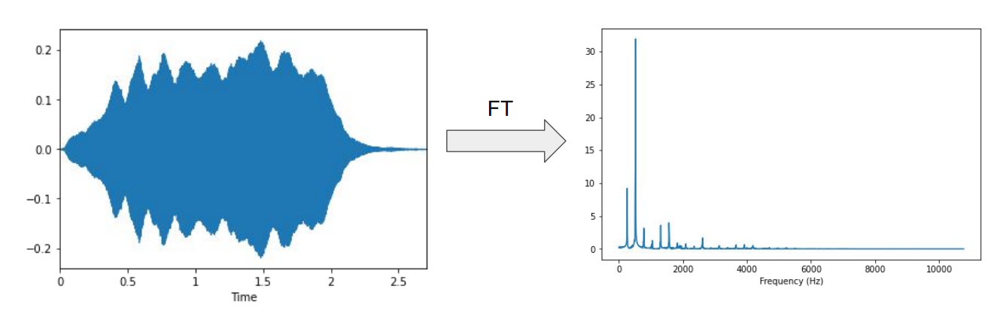
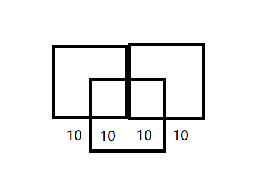

# STFT explained easily (短时傅里叶变换)
> STFT:
> 
> DFT和DTFT都适用于统计平稳的信号，不适用于**像语音这样的非平稳信号**，为此引入STFT，**将语音信号分成几十毫秒（一般为32ms）一帧的信号，每一帧近似是平稳的信号，然后每一帧进行DFT变换**:$$X(n,w)=\sum_{n=-\infin}^{\infin}x(m)w(n-m)e^{-jwm}$$
>
> 其中$x(m)$是输入信号，$w(m)$是分析窗

## 一、Previously
$$\huge \hat{x}(k)=\sum_{n=0}^{N-1}x[n]\cdot e^{-i2\pi s_r n \frac{k}{N}}\ \ \ ,k\in[0, N-1]$$

DFT: 
1. 对时间采样；
2. 对频率采样之后的FT。

we know what frequency components are present in a signal，but we don't know when they are more or less present, because all of them are averaged across the whole duration of the entire signal. 
 
(我们知道“哪些频率分量出现在了语音信号中”,可惜我们**不知道“什么时候这些频率分量出现”**, 这是因为我们最终得到的magnitude是源信号的在所有时间上的求和。)

**待解决问题**：frequency components evolve over time in the original signal. (原始信号中的频率分量（如何）随时间变化。)
- 解决方法：Apply FFT locally (在局部信号区域上应用FFT)
  
  
> STFT的目的就是去定位，哪些频率分量，出现在了音波的哪些位置

## 二、Windowing (加窗)
- Apply windowing function to signal (对信号应用加窗函数) $$x_w(k)=x(k)\cdot w(k)$$

> 默认window size = frame size， 但有时会发生window size > frame size

## 三、From DFT to STFT
$$DFT:\ \ \hat{x}(k)=\sum_{n=0}^{N-1}x[n]\cdot e^{-i2\pi s_r n \frac{k}{N}}\ \ \ ,k\in[0, N-1]$$
$$STFT:\ \ S(m, k)=\sum_{n=0}^{N-1}x[n+mH]\cdot w[n]\cdot e^{-i2\pi s_r n \frac{k}{N}}\ \ \ ,k\in[0, N-1]$$
> 记住：上面两个公式都是对n (时间轴) 求和
- $m$: frame number (帧号)
- $k$: sample number (样本号)
- $H$: hop size (跳跃步长)
- $mH$: starting sample of current frame (当前的frame的起始采样点)

## 四、Outputs (DFT和STFT的输出的区别)
- DFT (离散傅里叶变换)
  - Spectral vector (# frequency bins) (谱向量: 每个频率frequency一个复数对应（magnitude, phase）)
  - N complex Fourier coefficients (设采样点数量为N，则一共输出的是N个复数的“傅里叶系数”)
- STFT - 短时傅里叶变换
  - Spectral matrix (# frequency bins, # frames num)  (谱矩阵，（frequency, frames num） 对应 （magnitude, phase）)
  - Complex Fourier coefficients (复数傅里叶系数)
- $\# \textnormal{frequency bins}=\displaystyle\frac{\textnormal{framesize}}{2}+1$
  > \#frequency bins: 频域中样本之间的频率间隔/频率分布，即N
  > 
  > framesize: 一个frame里面有多少个samples

  > 实数序列DFT频谱$\hat{x}(k)$的共轭对称性: 
  > 
  > DFT频谱$\hat{x}(k)$满足共轭对称性，即$\hat{x}(k)=\hat{x}^*(N-k)$；因此振幅谱$|\hat{x}(k)|$关于$k=\frac{N}{2}$圆周偶对称，相位谱$\varphi(k)$关于$k=\frac{N}{2}$圆周奇对称。
  > 
  > 这意味着，我们可以做分析的时候会**把频谱砍掉一半**，防止发生信号**混叠 (aliasing)**现象，一般情况下抛弃后半段。如果**砍半之前**的振幅谱叫**双边振幅谱**。
- $\# \textnormal{frames num}=\displaystyle\frac{\textnormal{samples - framesize}}{\textnormal{hopsize}}+1$
- Example:
  - samples of signal: 40
  - frame size: 20
  - hop size: 10
  - $\# \textnormal{frequency bins}=\displaystyle\frac{\textnormal{framesize}}{2}+1=\displaystyle\frac{20}{2}+1=11$
  - $\# \textnormal{frames num}=\displaystyle\frac{\textnormal{samples - framesize}}{\textnormal{hopsize}}+1=\displaystyle\frac{40 - 20}{10}+1=3$
  
  

## 五、STFT parameters (STFT参数)
- Frame size (K): 512, 1024, 2048, 4096, 8192
  > Time / frequency trade off (时间/频率权衡)
  > - 增大frame size，则freq分辨率提高，但是时间分辨率降低
  > - 增大frame size，则freq分辨率提高，但是时间分辨率降低
  > 
  > 解释：当增大frame size的时候，即**一个frame中的sample 采样点的数量增大的，freq resolution提高**；
  > 
  > 同时，因为frame size增大，则相同的一段语音，**能够被切分成的frame的数量减少**；反之亦然。
- Hop size: 256, 512, 1024, 2048, 4096 或 ½ K, ¼ K, ⅛ K
- Windowing function （Haan window (汉宁窗)）: $$w(k)=0.5\cdot (1-cos(\frac{2\pi k}{K-1})), k=1...K$$
  
  

## 六、Visualising sound: Spectrogram (声音可视化: 能量谱)
$$\huge Y(m, k)=|S(m, k)|^2$$
> 即：STFT复数傅里叶系数的 magnitude(模) 的平方
>
> 能量谱密度: $|S(m, k)|^2$, 单位 (J/Hz)，表示在频率 f 处宽度为 df 的频带内的信号能量，也可以看成是单位频带内的信号能量。

> 声谱图 (Spectrogram)
> - 作用：表示在不同的时间和频率上这些声音的能量有多大
> - 横轴：时间
> - 纵轴：频率
> - 图中颜色：声波能量大小

Spectrogram和Spectrum的区别:
- Spectrogram: 声谱图
- Spectrum: 频谱图