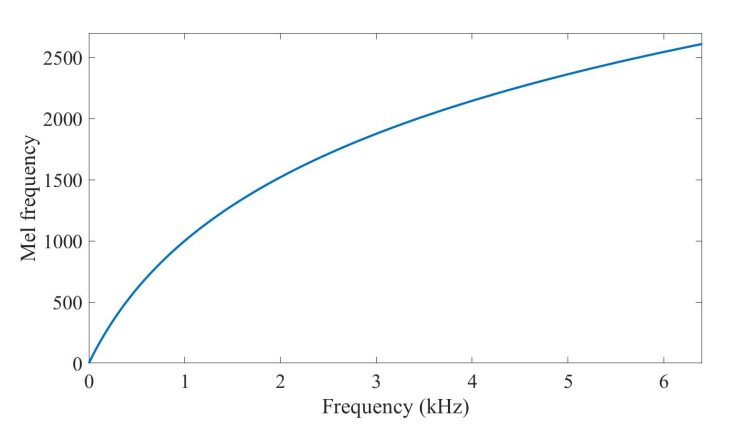
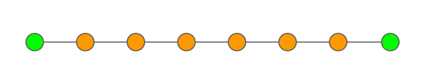
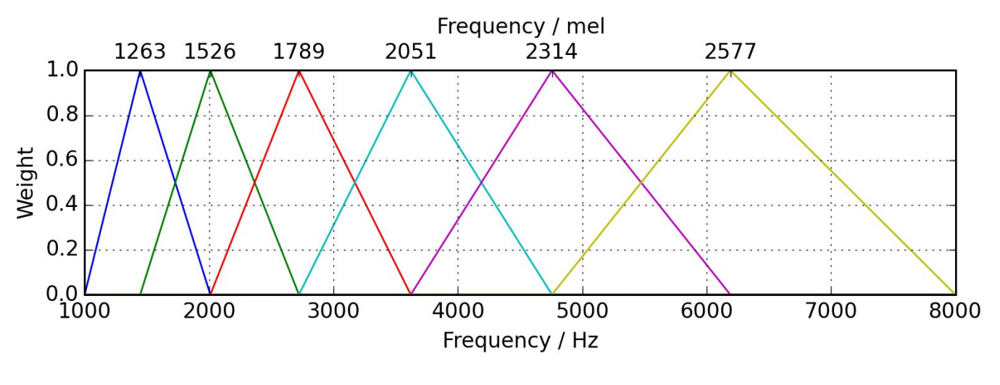
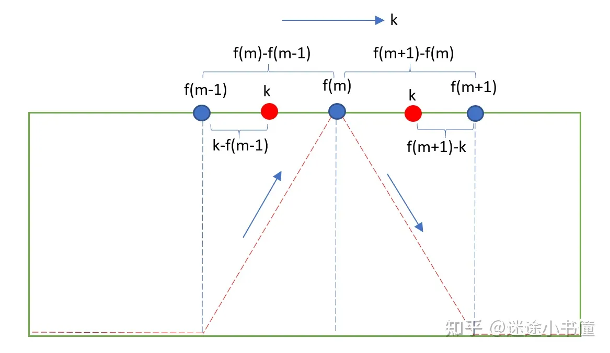
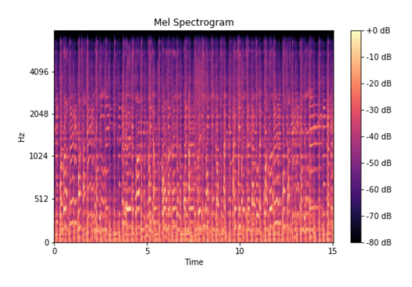

# Mel Spectrogram
## 一、Psychoacoustic experiment (心理声学的实验)
- 1st sample: C2 - C4 -> (65 - 262Hz) 差距为197Hz
- 2nd sample: G6 - A6 -> (1568 - 1760Hz) 差距为192Hz

可以得知两种跳跃的间隔都是200Hz左右，但是前者pitch相同，后者pitch不同，由此得出以线性的量度来感知频率是不可行的；因此引出下面的观点：
$$\huge \textnormal{Humans perceive frequency logarithmically}$$
> 人类以**对数**的量度来感知频率

## 二、Ideal audio feature (理想的音声特征)
- Time-frequency representation (时域-频域表示)
- Perceptually-relevant amplitude representation (感知相关的“振幅”表示方法)
- Perceptually-relevant frequency representation (感知相关的“频率”表示方法)

## 三、Mel-scale (梅尔刻度 （for pitch-音高）)
- Logarithmic scale (对数刻度)
- Equal distances on the scale have same “perceptual” distance (**在“梅尔刻度”上，相同的距离，有相同的“感知距离”**)
- 1000 Hz = 1000 Mel

$$m=2595\cdot log(1+\frac{f}{700})$$
$$f=700(10^{m/2595}-1)$$

> 上图中，在frequency在1000Hz以下的时候，近似和mel frequency之间是“线性”关系，之后，当frequency超过1000Hz的时候，和mel frequency更多是对数关系，类似于这个范围内的语音信号被以对数形式感知了。

## 四、Recipe to extract Mel spectrogram (抽取梅尔谱的算法)
- Extract STFT (抽取stft)
- Convert amplitude to DBs (把振幅转换为db，分贝)
- Convert frequencies to Mel scale (把频率转换为Mel-scale (梅尔刻度）)
  - Choose number of **mel bands** (选择mel频段的数量)
  - Construct **mel filter banks** (构建梅尔滤波器组)
  - Apply mel filter banks to **spectrogram** (应用梅尔滤波器组到声谱)

### 1. Choose number of **mel bands** (选择mel频段的数量)
It depends on the problem! (具体问题具体分析)

### 2. Construct **mel filter banks** (构建梅尔滤波器组)
- Convert lowest / highest frequency to Mel (将最低频率和最高频率转到mel-scale上)
  
  使用公式：$m=2595\cdot log(1+\frac{f}{700})$，得到两个端点，min和max
- Create # bands equally spaced points (创建等距点的带)
  
  在mel-scale上，在我们的频率范围内等距取到(# bands)个点，这些点是不同mel bands的中心频率

  （一共M+2个点，其中M是前面定好的mel bands的数量）

  
- Convert points back to Hertz (将取的点又转回Hertz)
  
  使用公式: $f=700(10^{m/2595}-1)$
- Round to nearest frequency bin (将这些中心频率点(float)取整到临近的frequency bin)
  
  > \#frequency bins: 频率区

  $\# \textnormal{frequency bins}=\displaystyle\frac{\textnormal{framesize}}{2}+1$
- Create Mel filter banks (生成三角滤波器)

  
  > the bottom of x axis: frequency(Hz)
  > 
  > the top of x axis: frequency(mel)
  > 
  > y axis: weight $\in{[0.0, 1.0]}$ (用来滤波)

  
  $$
  H_m(k)=
        \begin{cases}
        \text{$0\qquad\qquad\qquad\qquad\qquad k<f(m-1)$}\\
        \text{$\displaystyle\frac{k-f(m-1)}{f(m)-f(m-1)}\qquad \ \ \ f(m-1)\leq k\leq f(m)$}\\
        \text{$\displaystyle\frac{f(m+1)-k}{f(m+1)-f(m)}\qquad \ \ \ f(m)\leq k\leq f(m+1)$}\\ 
        \text{$0\qquad\qquad\qquad\qquad\qquad k>f(m+1)$}\\ 
        \end{cases}
  $$  
  - 上下的梅尔频率(mel)和频率(Hz)一一对应
  - 当前mel-band的下界和上界，分别是前面一个mel-band的中心频率，以及后面一个mel-band的中心频率
  - Mel filter banks’ shape = ($\# \textnormal{ bands num}$, $\displaystyle\frac{\textnormal{framesize}}{2}+1$)
    > 第一个维度 $\# \textnormal{ bands num}$ 是 mel-bands的数量
    > 
    > 第二个维度$\displaystyle\frac{\textnormal{framesize}}{2}+1$ 是 $\# \textnormal{frequency bins}$ (频率区)
### 3. Apply mel filter banks to **spectrogram** (应用梅尔滤波器组到声谱)
- Shape of matrix:
$$M_{\textnormal{shape}}=(\# \ \textnormal{bands num},\ \displaystyle\frac{\textnormal{framesize}}{2}+1)=(n, m)$$
$$Y_{\textnormal{shape}}=(\displaystyle\frac{\textnormal{framesize}}{2}+1,\ \# \ \textnormal{frames num})=(m, k)$$
$$U_{\textnormal{shape}}=\textnormal{M}\cdot\textnormal{Y}=(\# \ \textnormal{bands num},\ \# \ \textnormal{frames num})=(n, k)$$
- Matrix:
$$
M =
    \underbrace{\left[
        \begin{array}{c}
        \cdots  & w^{(1)} & \cdots\\
        \cdots  & w^{(2)} & \cdots\\
        \cdots  & \vdots  & \cdots\\
        \cdots  & w^{(n)} & \cdots\\
        \end{array}
        \right]}_m
$$
$$
Y = 
    \left .\ \left[
        \begin{array}{c}
        \vdots  & \vdots  & \vdots & \vdots\\
        y^{(1)} & y^{(2)} & \cdots & y^{(k)}\\
        \vdots  & \vdots  & \vdots & \vdots\\
        \end{array}
        \right]\right \}m
$$

$$
U = M\cdot Y =
    \left[
        \begin{array}{c}
        u_{11}  & u_{12}  & \cdots & u_{1k}\\
        u_{21}  & u_{22}  & \cdots & u_{2k}\\
        \vdots  & \vdots  & \ddots & \vdots\\
        u_{n1}  & u_{n2}  & \cdots & u_{nk}\\
        \end{array}
        \right]
$$
> M: Mel filter banks (梅尔滤波器组), 矩阵内是权重
> - $M_{nm}$第n个mel band 对 第m个频率的weight
>
> Y: Spectrogram (功率谱/能量谱), 矩阵内是magnitude
> - $Y_{mk}$是第k帧中第m个频率的magnitude
>
> U: Mel spectrogram (梅尔谱), 矩阵内是**加权后**的magnitude
> - $U_{nk}$是 **经过第n个mel band过滤/加权后 第k帧的magnitude**

> 简单来讲，梅尔谱只是把普通语谱图的频率从线性转到了梅尔尺度
> 
> 梅尔尺度是一种对数尺度，人类对于频率的感知在梅尔尺度上更加敏感
>
> 相比功率谱，梅尔普的第一个维度的向量数量减小了（频率数量 -> 梅尔频带数量），那么**原本数据的信息必然损失了一部分**，但因为梅尔刻度是**针对人类听觉的感知设计的**，因此梅尔频谱**很大程度上保留了人理解原本语音所需的信息**，这就是梅尔谱的精髓所在。

## 五、Mel spectrogram applications (梅尔谱的应用)
- Audio classification (音波分类)
- Automatic mood recognition (自动情感分析)
- Music genre classification (音乐曲风分类)
- Music instrument classification (音乐乐器分类)