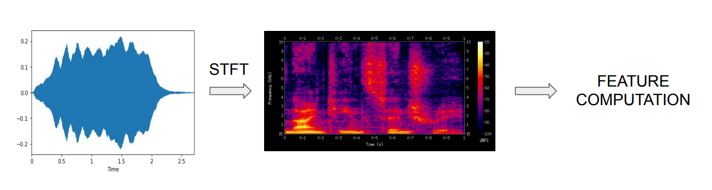

# Frequency-domain audio features (频域音频特征)
## 一、Frequency-domain features (频域特征)
- Band energy ratio (BER 频带能量比例)
- Spectral centroid (SC谱距心)
- Bandwidth (BW 带宽)
### 1. Extracting frequency-domain features

### 2. Math conventions
- $m_t(n)$: Magnitude of signal at frequency bin n and frame t (频率为n，帧为t的信号幅值)
- $N$: # frequency bins (频率区)
  > $\# \textnormal{frequency bins}=\displaystyle\frac{\textnormal{framesize}}{2}+1$

## 二、Band energy ratio (BER 频带能量比例)
- Comparison of energy in the lower/higher frequency bands (低频段和高频段能量的比较)
- Measure of how dominant low frequencies are （低频占据多大优势）

### 1. Function
$$BER_t=\frac{\displaystyle\sum_{n=1}^{F-1}m_t(n)^2}{\displaystyle\sum_{n=F}^{N}m_t(n)^2}$$
> 实际意义：低频能量 / 高频能量
>
> $m_t(n)^2$: 频率为n，帧为t处的能量
>
> $F$: Split frequency (切割频率)

### 2. Band energy ratio applications (波段能量率的应用)
-  Music / speech discrimination (音乐和语音的区别分类)
-  Music classification (e.g., music genre classification) (音乐的曲风分类)

## 三、Spectral centroid (SC谱距心)
- Centre of gravity of magnitude spectrum (幅度谱的重心)
- Frequency band where most of the energy is concentrated (**频率频带,大部分能量集中在那里**)
- Measure of “brightness” of sound (声音响度的度量)

### 1. Function
- Weighted mean of the frequencies (频率的加权平均值)
  $$SC_t=\frac{\displaystyle\sum_{n=1}^{N}m_t(n)\cdot n}{\displaystyle\sum_{n=1}^{N}m_t(n)}$$
> $m_t(n)$: 频率为n，帧为t处幅度 或 **n处的权重**

### 2. Spectral centroid applications (谱距心的应用)
- Audio classification (声音分类)
- Music classification (音乐分类)

## 四、Bandwidth (带宽，weighted mean)
- Derived from spectral centroid (衍生于”谱心“)
- Spectral range around the centroid (谱距心周围的频谱范围)
- Variance from the spectral centroid (谱距心的方差)
- Describe perceived timbre (感知”音色“)

### 1. Function
$$BW_t=\frac{\displaystyle\sum_{n=1}^{N}|n-SC_t|\cdot m_t(n)}{\displaystyle\sum_{n=1}^{N}m_t(n)}$$
> $|n-SC_t|$: 谱距心离频带n的距离
>
> $m_t(n)$: 频率为n，帧为t处幅度 或 **n处的权重**

Energy spread across frequency bands $\huge \uparrow$, $BW_t$ $\huge \uparrow$;

Energy spread across frequency bands $\huge \downarrow$, $BW_t$ $\huge \downarrow$.

### 2. Bandwidth applications (带宽引用)
- Music processing (e.g., music genre classification) (音乐处理，例如音乐曲风分类)