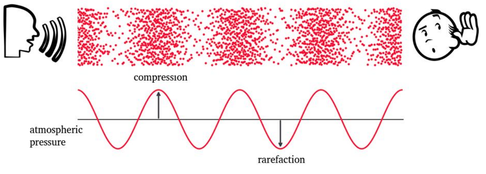
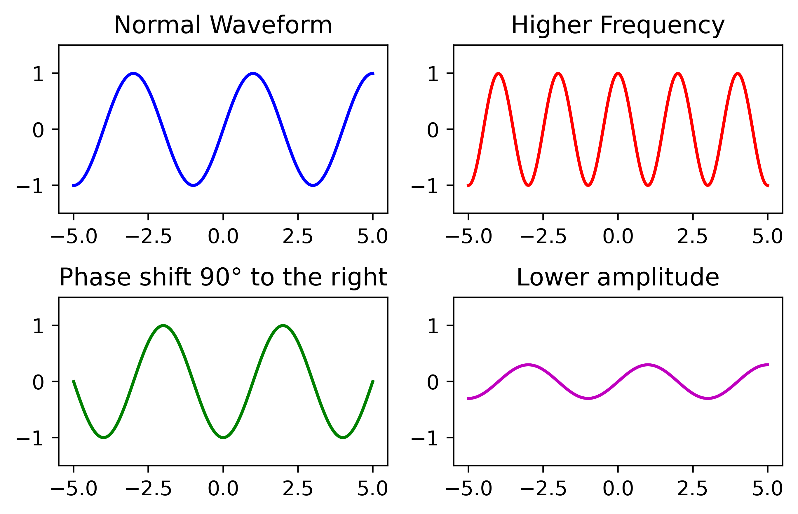
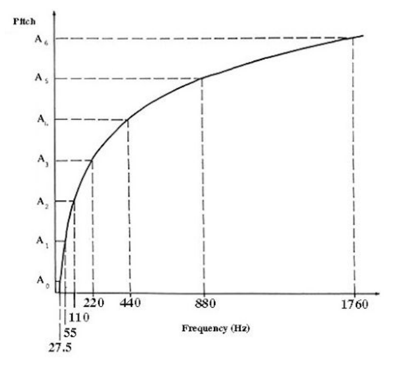

# Sound and waveforms
## 一、Sound
- Produced by vibration of an object
- Vibrations cause air molecules to oscillate
- Change in air pressure creates a wave

## 二、Mechanical wave (机械波)
- Oscillation that travels through space
- Energy travels from one point to another
- The medium is deformed

## 三、Sound Wave

空气分子稠密（高气压）的地方是波峰；空气分子稀疏（低气压）的地方是波谷

## 四、Waveform（波形图）
Carries multifactorial information:
- Frequency 
- Intensity
- Timbre

简单波形$y(t)=A\textnormal{sin}(2\pi ft+\varphi)$由振幅$A$、频率$f$、相位$\varphi$决定

频率越大，音调越高; 振幅越大，声音越响

## 五、Pitch (音高/音调)
- Logarithmic perception (对数)
- 2 frequencies are perceived similarly if they differ by a power of 2 （如果两个频率的差别是2的幂次，则他们听起来是一样的（即增八度）-除了强度和音量）

Pitch-frequency chart：

**Mapping pitch to frequency**:
$$\huge F(p)=2^{\frac{p-69}{12}}\cdot440$$
- example: $F(p)=2^{\frac{60-69}{12}}\cdot440 = 261.6$

## 六、Cents（音分）
- Octave divided in 1200 cents （八度音阶，被分成1200个音分）
- 100 cents in a semitone （一个“半音程”中有100个音分）
- Noticeable pitch difference: 10-25 cents （可识别的音高的差别：10-25音分）