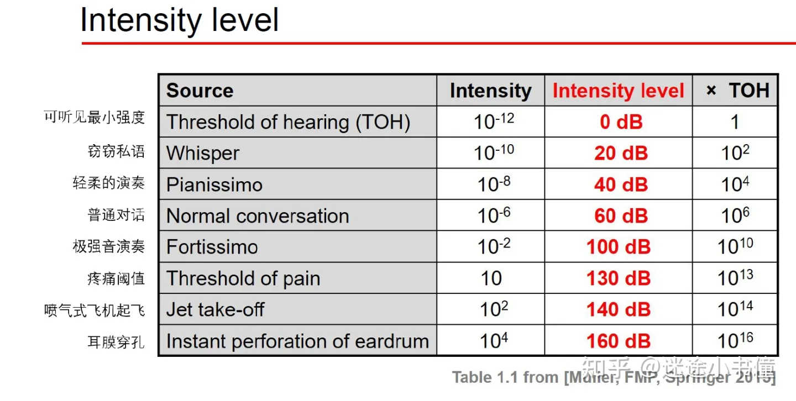
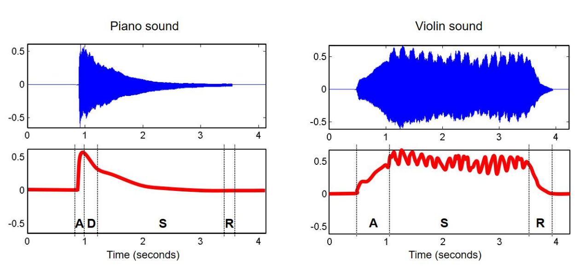
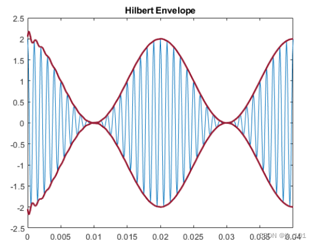
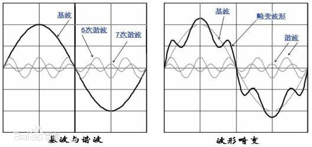
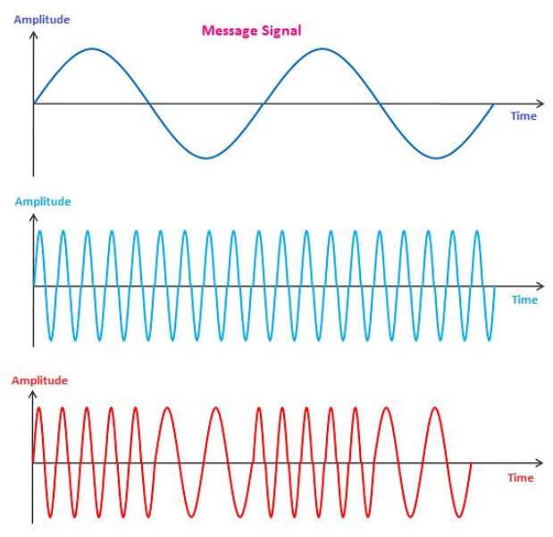
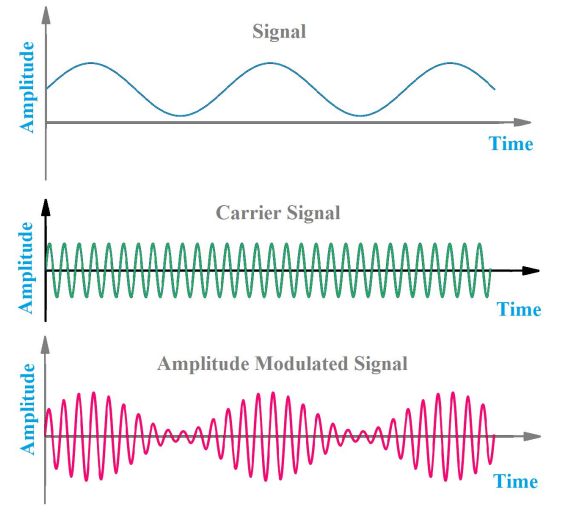

# Intensity, Loudness, and Timbre: 声强级，响度，和音色
## 一、Sound power - 声功率
- Rate at which energy is transferred （能量传递的率）
- Energy per unit of time emitted by a sound source in all directions （一个音源在所有方向上单位时间内发射的能量）
- Measured in watt (W) （声功率的度量单位是**瓦特**）

## 二、Threshold of hearing（听觉阈值）
- Human can perceive sounds with very small intensities.（人类可以感知强度很小的声音）
- $TOH=10^{-12}W/m^2(声强度单位)$
  > **TOH=threshold of hearing** 可听范围
- $TOP=10\cdot W/m^2(声强度单位)$
  > **TOP=threshold of pain** （耳朵）疼痛阈值

## 三、Intensity level (声强级)
- Logarithmic scale (对数刻度)
- Measured in decibels (dB) (使用分贝度量)
- Ratio between two intensity values (两个声强度值的比例)
- Use an intensity of reference (TOH) (使用参照TOH的声强度)
  
定义：$$\huge dB(I)=10\cdot log_{10}(\frac{I}{I_{TOH}})$$
- $dB(I_{TOH})=10\cdot log_{10}(\frac{I_{TOH}}{I_{TOH}})=0$, **即最小声强度TOH对应0分贝**
- Every ~3 dBs, intensity doubles ： 大约每增大3分贝，声强度翻倍。
  
  $dB(2I)-dB(I)=10\cdot log_{10}(\frac{2I}{I_{TOH}})-10\cdot log_{10}(\frac{I}{I_{TOH}})=10\cdot log_{10}2\approx 3dB$

## 四、Loudness (响度)
- Subjective perception of sound intensity (声强级的主观感知)
- Depends on duration / frequency of a sound (依赖于声音的音长/频率)
- Depends on age (依赖于年龄)
- Measured in phons (“方”是度量响度的单位)

Equal loudness contours：

横轴频率，纵轴$dB spl= 20log_{10}\frac{p}{p}$（声压级）

## 五、Timbre (音色)
- Colour of sound (声音的颜色)
- Diff between two sounds with same intensity, frequency, duration (两个具有相同强度、频率和持续时间的声音之间的差异)
- Described with words like: bright, dark, dull, harsh, warm (描绘音色的词包括，明亮，黑暗，迟钝，刺耳，温暖等（偏主观感受）)

What are the features of timbre? (音色的特征有哪些？)
- Timbre is multidimensional (多维度的)
- **Sound envelope** (声音包络线)
  
  
  > 包络线的定义：一曲线族的包络线是这样的曲线：该曲线不包含于曲线族中，但过该曲线的每一点，都有曲线族中的一条曲线与它在这一点相切。信号中的包络信号是指一个高频调幅信号，它幅度是按低频调制信号变化的。如果把高频调幅信号的峰点连接起来，就可以得到一个与低频调制信号相对应的曲线。这条曲线就是包络线。
  > 
  > 简单的说就是**两条能够把信号波形包起来的曲线**。
  > 
  > 
- Harmonic content (谐波量)
- Amplitude / Frequency modulation (调幅/调频)

### 1. Complex sound （复合声）
- Superposition of sinusoids （正弦波的叠加）
- A partial is a sinusoid used to describe a sound （“分音”-正弦来描述声音）
- The lowest partial is called fundamental frequency （最低的partial/分音被称为基频，即**周期信号的基波频率**）
- A harmonic partial is a frequency that’s a multiple of the fundamental frequency （一个谐和的partial/分音是一个基频的倍数，即**周期信号的谐波分量**）例如：
  
  f1=440; f2=2\*440=880, f3=3\*440=1320,...

基波与谐波的相关概念：
- 基波: 是指在复杂的周期性振荡中与**该振荡最长周期**相等的正弦波分量，相应于这个周期的频率称为基波频率。 
- 谐波：对周期性交流量进行傅里叶级数分解，得到频率为基波频率大于1整数倍的分量
- 周期信号分析：一个周期信号可以通过傅里叶变换分解为直流分量$c_0$和不同频率的正弦信号的线性叠加：$$f(t)=c_0+\sum_{m=1}^{\infin}c_m\textnormal{sin}(m\omega\textnormal{t}+\varphi_m)$$
  - 当$m=1$时，$c_1\textnormal{sin}(\omega\textnormal{t}+\varphi_1)$为基波分量的表达式，其角频率为ω，初始相位为φ1，其方均根值$\frac{c_1}{\sqrt{2}}$称为基波有效值。
  - 当$m>1$时，剩下的$c_m\textnormal{sin}(m\omega\textnormal{t}+\varphi_m)$为谐波分量
  - 基波频率为$\displaystyle\frac{\omega}{2\pi}$，而m次谐波的频率为基波频率的m倍

### 2. Frequency modulation (频率调制/调频)
> 调频：使载波的瞬时频率按照所需传递信号的变化规律而变化的调制方法。
>
> 由调频方法产生的无线电波叫调频波 (FM),其基本特征是**载波的振荡幅度保持不变，振荡频率随调制信号而变**。
>
> FM信号偏离载波频率的频率偏移量，与调制信号的振幅有关。频率偏移的改变速率则与调制信号的频率有关。
- AKA vibrato (颤音, 改变的是音高/音调/**频率**)
- Periodic variation in frequency (频率上的周期性变化)
- In music, used for expressive purposes (在音乐里面，用来做富有表现力的目的)

从上到下依次是：**信号波、载波、FM波**

### 3. Amplitude modulation (调幅/幅度调制)
> 调幅：使高频载波的振幅按照所需传送信号的变化规律而变化，但频率保持不变的调制方法。
>
> [幅度调制基本原理](https://zhuanlan.zhihu.com/p/399639771?ivk_sa=1024320u):
>
> 
> 
> 
- AKA tremolo (颤音, 改变的是音量/强度/**幅度**)
- Periodic variation in amplitude (振幅上的周期性变化)
- In music, used for expressive purposes (在音乐上，同样是为了富有表现力的表达的目的)

从上到下依次是：**信号波、载波、AM波**

## Recap (小结)
### 1. Timbre recap (音色小结)
- Multifactorial sound dimension (多因子的语音维度)
- Amplitude envelope (振幅包络)
- Distribution of energy across partials (跨越分音的能量分布)
- Signal modulation (frequency/amplitude) (信号调制（频度/振幅）)

### 2. Sound recap (声音小结)
- Sound is a wave (声音是波)
- Frequency, intensity, timbre (频率，强度，音色)
- Pitch, loudness, timbre (音高/音调，响度，音色)