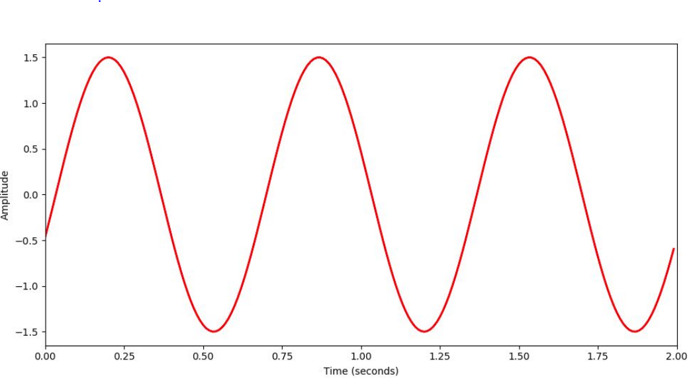
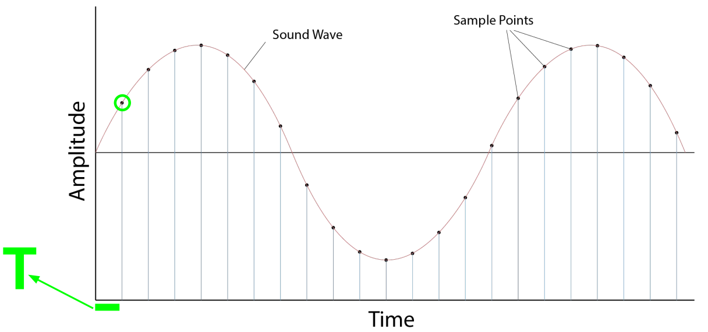
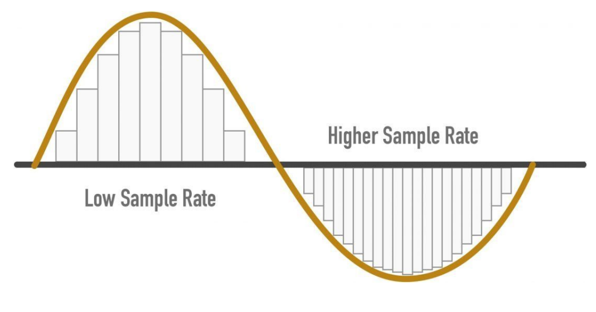
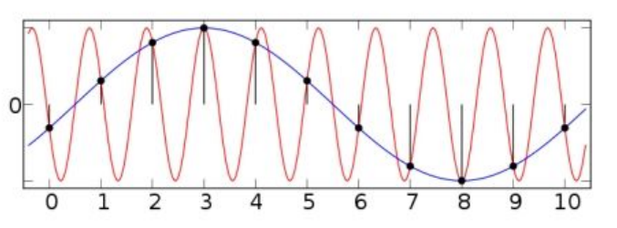
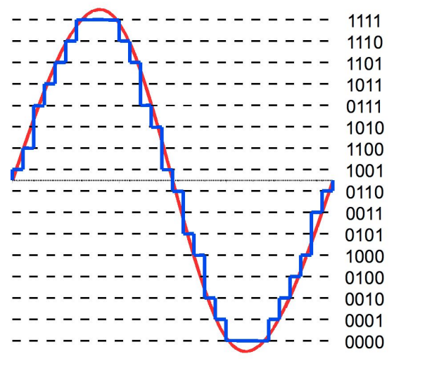

# Understanding audio signals for ML (理解面向机器学习的音频信号)
## 一、Audio signal (音频信号)
- Representation of sound (声音的表示)
- Encodes all info we need to **reproduce** sound (编码了**再生**声音所需要的所有信息)

### 1. Analog signal - 模拟信号
- **Continuous** values for time (时间维度是**连续**的值)
- **Continuous** values for amplitude (幅度是**连续**的值)

  

### 2. Digital signal - 数字信号
- Sequence of discrete values (离散值的序列)
- Data points can only take on a **finite** number of values (数据点只能包括**有限的数量**的值)

## 二、 Analog to digital conversion (模拟信号转数字信号 ADC)
- "pulse-code modulation" (ADC的过程 = 脉冲编码调制)
  - Sampling (采样)
  - Quantization (数字化，量化)

### 1. Sampling (采样)
信号采样(抽样)是连续信号在时间上的离散化，即按照一定时间间隔△t 在模拟信号x(t)上逐点采取其瞬时值。**它是通过采样脉冲和模拟信号相乘来实现的。**

如上图所示，采样区间是均匀分布：按照固定的时间间隔来获取振幅的值。
- Locating samples (定位采样点)
  $$\huge t_n=n\cdot T$$
- Sampling rate (采样率，单位$Hz$)
  $$\huge s_r = \frac{1}{T}$$
  > 含义：一秒能采样多少个点
  > 
  > - 例如，采样率为44100Hz，即1秒有44100个点
  
  

  上图左边，是低采样率的示例；右边是高采样率(更接近真实的模拟信号)的示例

#### 1) Nyquist frequency (奈奎斯特频率)
  $$\huge s_r=2\cdot f_n$$
  > **奈奎斯特频率**（Nyquist frequency）是为防止信号混叠需要**定义最小采样频率**
  > 
  > 采样定理（奈奎斯特定理）:
  > 
  > 当采样频率$s_r$大于信号中最高频率$f_{max}$的2倍时($s_r>2f_{max}$)，**采样之后的数字信号完整地保留了原始信号中的信息**，一般实际应用中保证采样频率为信号最高频率的2.56～4倍
- Nyquist frequency for CD: $44100Hz$
  
  原因：人类能听到的声音频率范围：20~20000Hz；所以对于CD，最高频率约为$f_N=\displaystyle\frac{44100}{2}=22050Hz$，所以设置奈奎斯特采样频率为44100Hz

#### 2) Aliasing (错误识别采样频率)
  
  

  红色=模拟信号；其频率大于采样的点的频次。（频次10>>蓝色的频次1)

  **当采样率$s_r$低于信号中的最高频率$f_{max}$时，会错误识别采样频率**

  例：当对44100的音频，按照1000Hz重新采样之后，失声很严重，听不出来原来的音乐了。

### 2. Quantization (量化)
量化，在数字信号处理领域，是指将信号的连续取值（或者大量可能的离散取值）近似为有限多个（或较少的）离散值的过程。

- Resolution = num. of bits (分辨率 = 位数)
- Bit depth (位深度)
> resolution与Bit depth是同义词
- CD quantization resolution = 16 bits (CD的分辨率为16bits)
  - 例：CD的分辨率为16bits，则所有可以使用的幅度值为$2^{16}=65536$
  
#### 1) Memory for 1’ of sound (记忆1分钟的声音)
设：
- Sampling rate = 44100 Hz
- Bit depth = 16 bits

且:
- $1\ Mb=1024\cdot 1024\cdot 8 = 8,388,608\ bits$
- $1\ \textnormal{minutes}=60\ \textnormal{seconds}$

则，一首1分钟的高保真的歌曲，在CD中的大小为：
$$((16\cdot 44,100)/8,388,608)\cdot60=5.49MB$$

#### 2) Dynamic range (动态区间)
- Difference between largest/smallest signal a system can record (一个系统可以录音的最大和最小的信号)

关系在于：当我们使用更多的bits表示一个采样点的值的时候（振幅），则**resolution(分辨率）越高，从而dynamic range也越大（能够表示的振幅范围越大）**。
> **动态范围**指的是可以达到的**最大不失真电平与本底噪声的差值**。
> 
> 而对于数字音频来说，信号是离散化的，在电压（振幅）上只有有限个取值，因此，在将模拟信号转换为数字信号的过程中，必然会引入一定的误差，其被称为**量化误差**。
> 
> 量化误差的存在，就导致了被采样后的数字信号，会存在一定的量化噪声。量化噪声的存在，也就使得数字音频存在了一定的**动态范围**。也即**所能记录的最大振幅（电平）**，和**能够还原为原始信号的最小振幅（电平）之间的范围**。

#### 3) Signal-to-quantization-noise ratio （SQNR） ： 信号与量化噪声之比
- Relationship between max signal strength and quantization error - 最大信号强度和“量化error”之间的关系
- Correlates with dynamic range 和动态区间相关
  $$SQNR=20log_{10}2^Q\approx6.02\cdot Q$$
  $$SQNR(16)\approx96dB$$
  > $log_ab$: 以a为底b的对数

  Q=bit depth，

  即，当bit depth=16bits的时候，dynamic range就是96分贝。

  **AD 位深度越大，信噪比越高，量化误差越小**