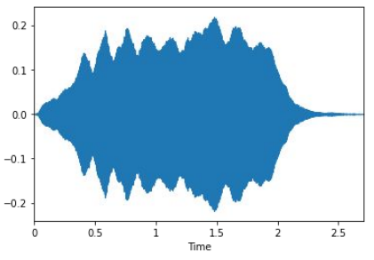
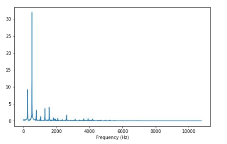
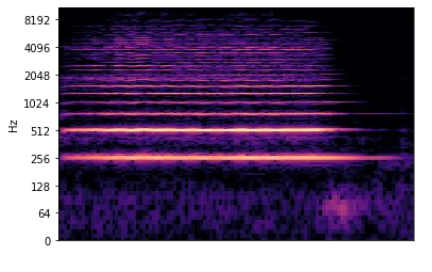
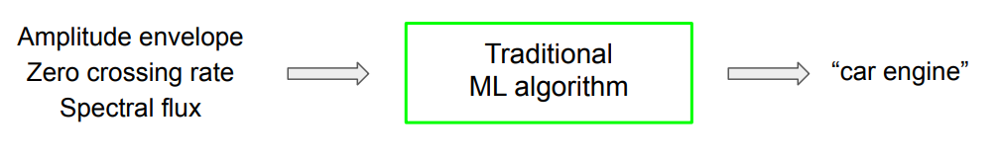
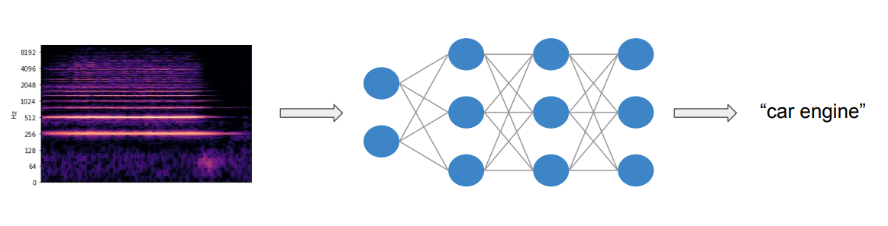

# Types Audio Features for ML
## 一、Why audio features? (为什么需要音频特征？)
- Description of sound (对声音的表示)
- Different features capture different aspects of sound (不同的特征类型，捕捉的是声音的不同方面的信息)
- Build intelligent audio systems (构建智能语音系统)

## 二、Audio feature categorisation (语音特征分类（五个角度）)
- Level of abstraction (抽象级别)
- Temporal scope (时序范围)
- Music aspect (音乐维度)
- Signal domain (信号域)
- ML approach (机器学习方法)

### 1. Level of abstraction (抽象级别)
- 高抽象级别
  - instrumentation (乐器法)
  - key (键盘)
  - chords (和弦)
  - melody (旋律)
  - rhythm (节奏)
  - tempo (节拍)
  - lyrics (歌词)
  - genre (曲风)
  - mood (情绪)
- 中抽象级别
  - pitch and beat related descriptors (基于音高和节拍的描述符)
  - note onsets (音符初动时间)
  - fluctuation patterns (波动模式)
  - MFCCs (梅尔频率倒谱系数)
- **低抽象级别**
  - amplitude envelope (振幅包络)
  - energy (能量)
  - spectral centroid (谱距心)
  - spectral flex (谱通量)
  - zero-crossing rate (过零率，波穿越横轴的次数/时间) [直接从wav文件中抽取出来的]

### 2. Temporal scope (时序范围)
- Instaneous (~50ms) (瞬发的)
- Segment-level (seconds) (段落级别，秒级)
- Global (全局)

### 3. Music aspect (音乐维度)
- Beat (节拍)
- Timbre (音色)
- Pitch (音高)
- Harmony (和声)

### 4. Signal domain (信号域)
- 时间域，Time Domain,
  - Amplitude envelope (振幅包络)
  - Root-mean square energy (均方根能量)
  - Zero crossing rate (过零率)

  
- 频域，Frequency Domain (时域->傅里叶变换->频域）
  - Band energy ratio (频带能量比例)
  - Spectral centroid (谱距心)
  - Spectral flux (谱流量)

  
- 时间-频率表示，Time-frequency representation（同时包括了时间和频率信息）
  - Spectrogram (谱)
  - Mel-spectrogram (梅尔谱)
  - Constant-Q transform (常数Q变换)

  

## 三、Machine learning approach (机器学习方法)
- Traditional machine learning (传统机器学习方法)
- Deep learning (深度学习方法)

### 1. Traditional machine learning (传统机器学习方法)
- Amplitude envelope (振幅包络)
- Root-mean square energy (均方根能量)
- Zero crossing rate (过零率)
- Band energy ratio (频带能量比例)
- Spectral centroid (谱距心)
- Spectral flux (谱通量)
- Spectral spread (谱传播)
- Spectral roll-off (谱衰减)

### 2. Deep learning (深度学习方法)

### 3. Types of intelligent audio systems (智能音频系统的类型)

> DSP: Digitial Signal Processing (数字信号处理)