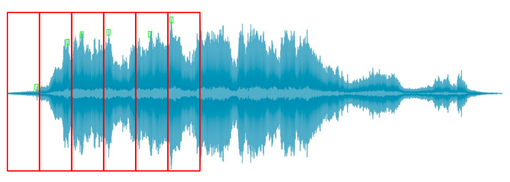
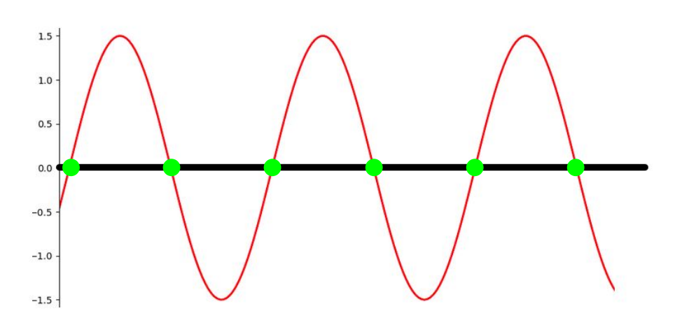

# Time-domain audio features (时域音频特性)
## 一、Time-domain features (时域特征)
- Amplitude envelope (AE, 振幅包络) 
- Root-mean-square energy (RMS, 平方根能量) 
- Zero-crossing rate (ZCR, 过零率) 

### 1. Amplitude envelope (AE, 振幅包络) 
- Max amplitude value of all samples in a frame (一帧内所有samples的最大振幅值):$$AE_t=max_{k=t\cdot K}^{(t+1)\cdot K-1}s(k)$$
  - $K: \textnormal{Frame size}$ (一帧的sample数量)
  - $s(k): \textnormal{Amplitude of kth sample}$
  - $k\in[t\cdot K,(t+1)\cdot K-1]$
    - $t\cdot K$: first sample of frame t
    - $(t+1)\cdot K-1$: last sample of frame t
  
  
- Gives rough idea of loudness (给出了响度的大致概念)
- Sensitive to outliers (对异常值敏感)
- Onset detection, music genre classification (起始探测，音乐曲风分类)
### 2. Root-mean-square energy (RMS, 均方根能量)
- RMS of all samples in a frame (一个坐标系中所有样本的均方根)$$RMS_t=\sqrt{\frac{1}{K}\cdot\sum_{k = t\cdot K}^{(t+1)\cdot K-1}s(k)^2}$$
  - $s(k)^2$: Energy of *k*th sample
- Indicator of loudness (响度的指示符)
- Less sensitive to outliers than AE (相比于“振幅包络”，RMS对异常值更加不敏感)
- Audio segmentation, music genre classification (音频切分，音乐曲风分类)

### 3. Zero-crossing rate (ZCR, 过零率)
- Number of times a signal crosses the horizontal axis (信号穿过横轴的次数)$$ZCR_t=\frac{1}{2}\cdot\sum_{k=t\cdot K}^{(t+1)\cdot K-1}|\ sgn(s(k))-sgn(s(k+1))\ |$$ $$sgn(x)=\begin{cases}\text{$1$\ \ \ \ \ x>0}\\\text{$-1$\ \ x<0}\\\text{$0$\ \ \ \ \ x=0}\\ \end{cases}$$
  - 例：$sgn(s(k))<0, sgn(s(k+1))>0$
    
    则 $|sgn(s(k))-sgn(s(k+1))|=2$
  
  
- Recognition of percussive vs pitched sounds (打击音和高音的识别)
- Monophonic pitch estimation = (单声道音高估计: **ZCR越大，一般pitch越高**)
- Voice/unvoiced decision for speech signals (针对语音信号的清音/浊音决定)