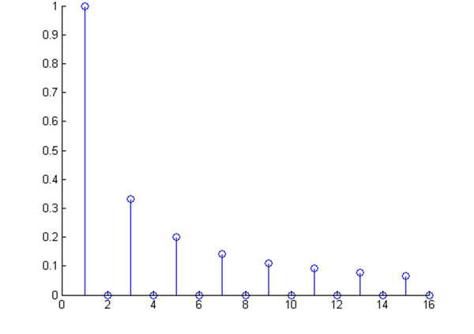

# [理解傅里叶变换](https://mp.weixin.qq.com/s?__biz=MzI5MDUyMDIxNA==&mid=2247515457&idx=1&sn=0c1950fe3c01d78e78246092c1c55c1b&chksm=ec1c50b8db6bd9ae155236657186a26064a2eea878c2264f790a4ebdc9cea65c6ffb521a1dd9&scene=21#wechat_redirect)
## 一、频域与时域的通俗理解
时域：
- 横轴：时间
- 纵轴：音频的波幅
- 画出的波形：波形图
   

频域：
- 横轴：频率
- 纵轴：该频率信号的幅度
- 画出的波形：频谱图
   
   

傅里叶分析是**贯穿频域与时域的方法**，可分为**傅里叶级数和傅里叶变换**

## 二、傅里叶级数的频谱
正面看波形图，侧面看频谱图：

## 三、傅里叶级数的相位谱
傅里叶变换的作用：
1. 很多在时域看似不可能做到的数学操作，在频域相反很容易（比如滤波）。
   
   在时域中，画一个$sin(3x)+sin(5x)$非常困难；如果已知$sin(3x)+sin(5x)$的曲线将$sin(5x)$从曲线中拿出也很难做到。

   但是，**在频域中，$sin(3x)+sin(5x)$无非就是几条竖线罢了**。
2. 求解微分方程
   
   傅里叶变换可以**让微分和积分在频域中变为乘法和除法**

从之前的三维图的下方看，就可以得到相位谱：

在图中就是那些小红点,小红点是距离频率轴最近的波峰。

## 四、傅里叶变换
傅里叶级数的本质是将一个周期的信号分解成无限多分开的（离散的）正弦波。

傅里叶级数，**在时域是一个周期且连续的函数，而在频域是一个非周期离散的函数**；

傅里叶变换，**则是将一个时域非周期的连续信号，转换为一个在频域非周期的连续信号**。

将频谱从离散谱变成连续谱：

离散谱的叠加，变成了连续谱的累积。所以在计算上也从求和符号变成了积分符号

## 五、欧拉公式
$$\huge e^{ix} = \textnormal{cos}x+i\textnormal{sin}x$$
欧拉公式将正弦波统一成了简单的指数形式：

## 六、指数形式的傅里叶变换
对正弦波的理解：
1. 第一种：螺旋线在实轴的投影
2. 第二种：$\textnormal{cos}(t)=\displaystyle\frac{e^{it}+e^{-it}}{2}$

   $e^{it}$可以理解为一条逆时针旋转的螺旋线，那么$e^{-it}$则可以理解为一条顺时针旋转的螺旋线。而$\textnormal{cos}(t)$则是这两条旋转方向不同的螺旋线叠加的一半，因为这两条螺旋线的虚数部分相互抵消掉了

复频域->频域->时域：

